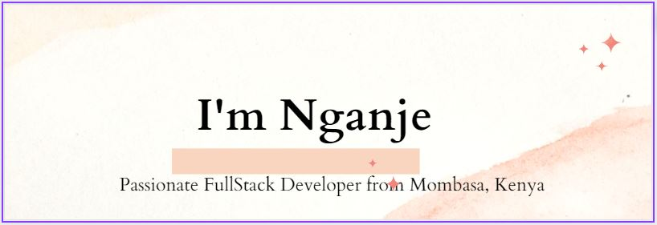

### Hi there 👋

  <h1>
    Welcome to my page!
  </h1>

- 🔭 I’m currently working on: **Fullstack applications - React Redux NodeJs and MongoDB**

- 👨‍💻 All of my projects are available at [https://github.com/asnganje?tab=repositories](https://github.com/asnganje?tab=repositories)
  
- 📫 You can reach via email at: **abd.nganje@gmail.com**

- ⚡ Fun fact **I like playing Chess**

<h3 align="left">Connect with me:</h3>

<h3 align="left">Languages and Tools used:</h3>

        

